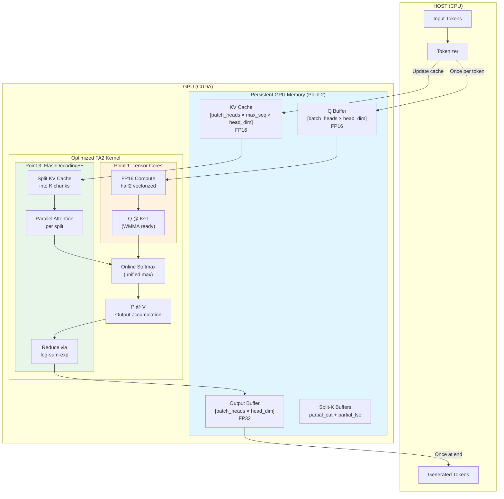
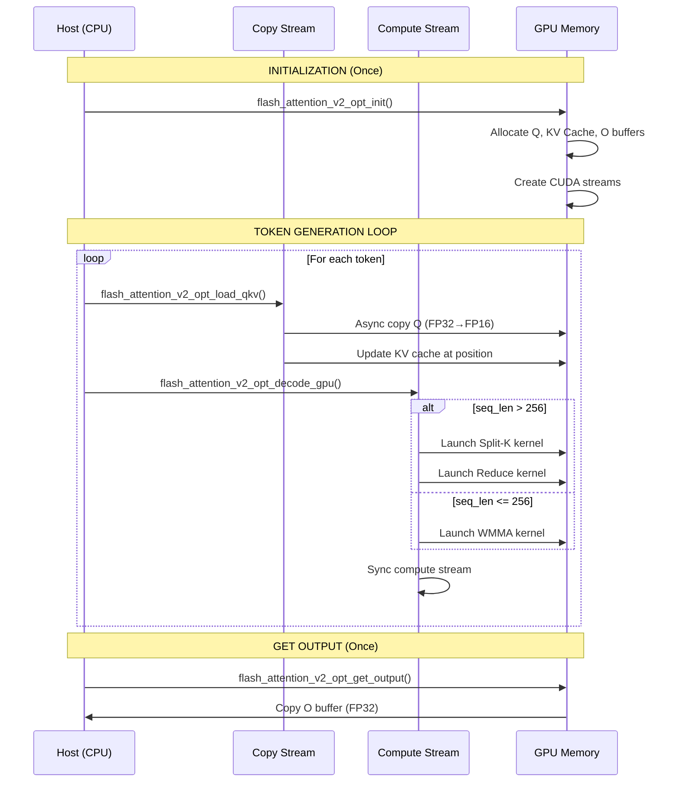
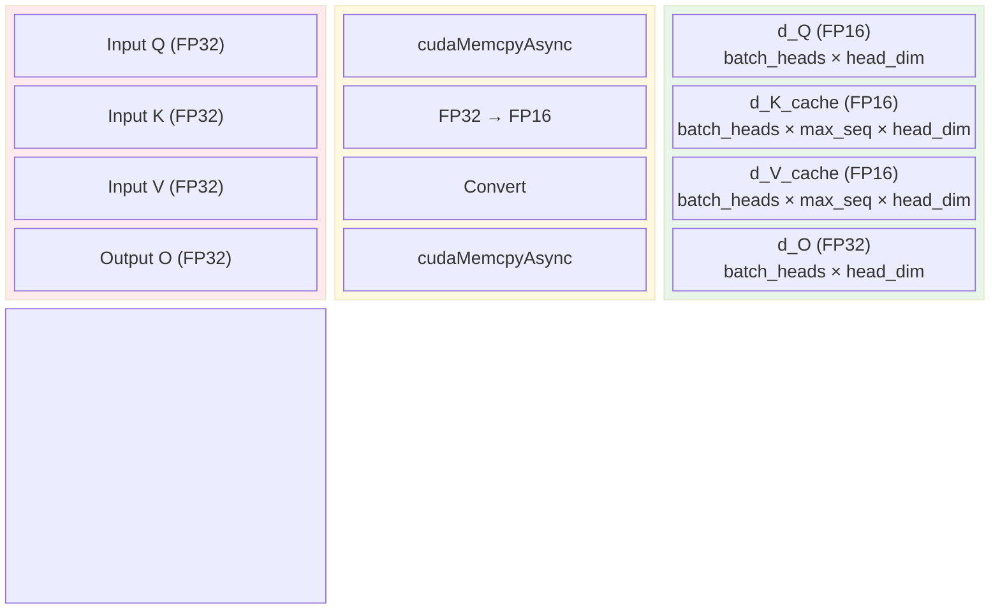
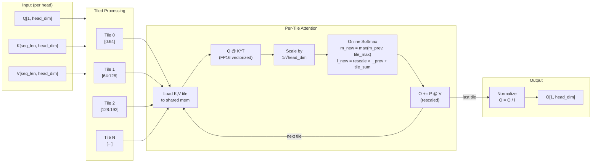
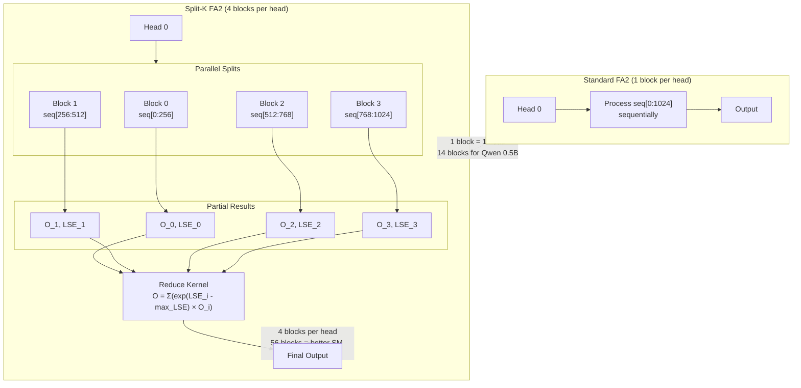
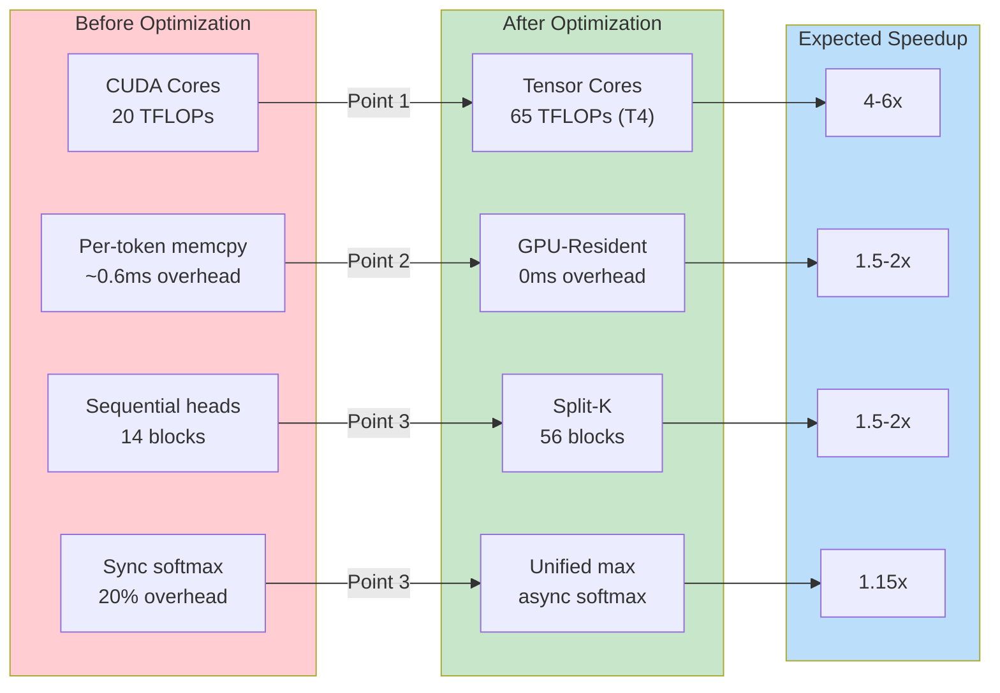
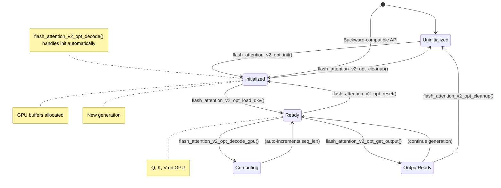

# FlashAttention-2 Optimized Architecture

## System Overview



## Detailed Processing Flow



## Memory Layout



## Kernel Architecture



## Split-K Parallelism (Point 3)



## Optimization Impact



## API Usage Flow



## File Structure

```
mojo-gateway/src/kernels/cuda/
├── flash_attention_v2.cu              # Original FA2 (baseline)
├── flash_attention_v2.h
├── flash_attention_v2_optimized.cu    # NEW: 3-point optimized
├── flash_attention_v2_optimized.h     # NEW: GPU-Resident API
├── test_flash_attention_v2_optimized.cu  # NEW: Frozen benchmark tests
└── Makefile                           # Updated with fa2-opt target

Build: make fa2-opt CUDA_ARCH="-gencode arch=compute_75,code=sm_75"
Test:  make test-fa2-opt
```
